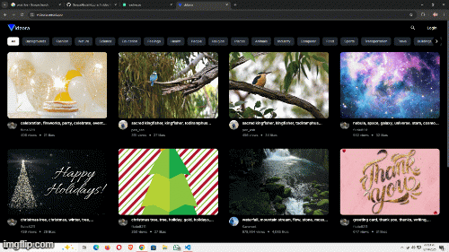

# Vidzora

A modern video-library web application that provides a rich collection of curated videos for seamless browsing and management.

---

## 🌐 Live

🚀 View the live application:  
👉 [https://vidzora.vercel.app](https://vidzora.vercel.app)

---

## 🎬 Demo

---

## ✨ Features

- 🔐 Secure email OTP-based authentication  
- 📁 Save videos to multiple collections (Playlists, Favourites, Watch Later)  
- 🖥️ Fullscreen video playback experience  
- ♾️ Infinite scrolling for smooth content loading  
- 📱 Fully responsive across all screen sizes  

---

## 🛠️ Tech Stack

### Client
- TypeScript  
- React  
- Zustand  
- Tailwind CSS  
- Material UI  

### Backend / Services
- Supabase  
- Brevo  
- Pixabay  
